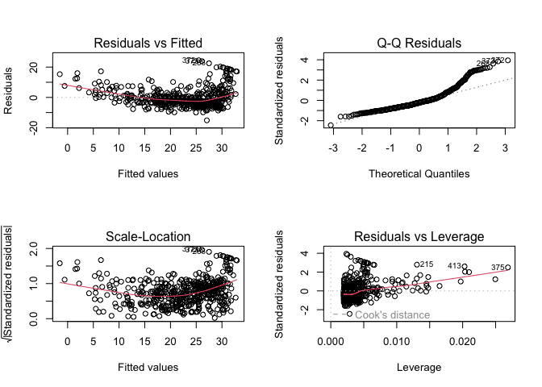

# Intro to Machine Learning Notes

## R Setup

``` r
#Load packages for chapter labs
library("ISLR2") #Introduction to Statistical Learning datasets'
library("tidyverse")
```

## Week 1 Notes

Types of machine learning:

- Supervised learning

  - Regression models - quantitative/continous output
  - Classification models - qualitative/discrete output

- Unsupervised learning

  - Clustering models - patterns from input data without specified
    output

Why study statistical learning?

- Inference - how does a particular input drive an output variable

- Prediction - only the value of the outcome variable is of interest

  - Example: “How much rainfall will California have in 2050?”?

## Week 2: Statistical Learning Introduction

### Notes

Shared assumptions of linear and non-linear statistical models for
estimating *f*:

- Parametric vs. non-parametric

- Flexibility (complexity) vs. interpretability

  - Flexible models are beneficial for prediction
  - Interpretable models are beneficial for inference

- Supervised vs. unsupervised learning

  - Unsupervised has no specified outcome variable

How to determine the best statistical model for a problem

- Quality of fit

- Variance/Bias tradeoff

  - Variance: the amount by which $\hat{f}$ would change if estimated
    with a different training set
  - Bias: the error that is introduced by approximating a real-life
    problem, which may be extremely complicated, by a much simpler
    model.
  - In general, with more flexible methods, variance increases and bias
    decreases

Inference vs. Prediction

- Sometimes both are of interest, but often only one is of primary
  interest. The goals of the analyst here are the primary driver in
  selecting a model

How do we estimate *f*?

- Training data used to estimate *f*

- Parametric approach

  - Step 1: Specify an estimated functional form for *f* (i.e. a linear
    function)

  - Step 2: Training data is used to estimate the parameters of the
    function

  - Disadvantage of parametric methods: not well suited to estimate a
    function for a complex dataset

- Non-parametric approach

  - Avoids the assumption of a particular functional form for *f*

  - Disadvantage: they require very large data sets to make an accurate
    prediction of *f*

Why would we ever choose to use a more restrective method instead of a
very flexible approach?

- Interpretability, inference, to avoid overfitting

Should we always choose a more complex (flexible) approach when
prediction is the objective?

- Only if there is a very large dataset. With a small amount of data,
  more complexity is not always good

Measuring the Quality of Fit

- Mean Squared Error (MSE)

  $$
  MSE = \frac{1}{n}\sum_{i=1}^n(y_i-\hat{f}(x_i))^2
  $$

- Training MSE vs. Test MSE

- Why does *training* MSE always decrease with added flexibility?

  - With enough flexibility you can get your model to perfectly fit the
    training data (but *test* MSE would be much worse)

- highest quality of fit does not equal the best predictive model
  (overfitting)

### Lab: Intro to R

`c()` Create a vector of items

`length()` Returns the length of a vector

`ls()` Lists all objects such as data and functions saved in the
environment

`rm()` Remove an object from the environment

`matrix(data = , nrow = , ncol =)` Create a matrix

`sqrt()` calculate the square root

`rnorm(n)` Generates a vector of random normal variables of <sub>n</sub>
sample size

`cor(x, y)` Calculates the correlation between two sets of numbers

`set.seed()` Used to set a consistent seed for a random number function

`mean()` Mean

`var()` Variance

`sd()` Standard Deviation

`plot()` Basic plotting function

`countour()` Creates a countour plot to represent 3D data

``` r
x <- seq(1,10)
x
```

     [1]  1  2  3  4  5  6  7  8  9 10

``` r
x <- 1:10
x
```

     [1]  1  2  3  4  5  6  7  8  9 10

``` r
x <- seq(-pi, pi, length = 50)

y <- x
f <- outer(x, y, function(x, y) cos(y) / (1 + x^2))

contour(x, y, f)
contour(x, y, f, nlevels = 45, add = T)
```


``` r
fa <- (f - t(f)) / 2
contour(x, y, fa, nlevels = 15)
```


`image()` Produces a heatmap plot

`persp()` Creates a 3D plot, arguments `theta` and `phi` control the
viewing angles

``` r
image(x, y, fa)
```


``` r
persp(x, y, fa)
```


``` r
persp(x, y, fa, theta = 30)
```


``` r
persp(x, y, fa, theta = 30, phi = 20)
```


``` r
persp(x, y, fa, theta = 30, phi = 70)
```


``` r
persp(x, y, fa, theta = 30, phi = 40)
```


`dim()` Dimension function returns the number of rows and columns of a
matrix

`read.table()` Import data

`write.table()` Export data

Data Frame functions

`data.frame()` Create a data frame

`str()` Used to view a list of variables and first few observations in a
data table

`subset()` Used to filter a data table

`order()` Used to return the order of a vector, can sort a data table

`list()` Create a list

## Week 3: Linear Regression

### Notes

Inference problem example - which advertising strategy will lead to
higher product sales next year?

*Simple linear regression* is a a method for predicting a quantitative
response *Y* on the basis of a single predictor variable *X*. A simple
model uses the equation:

$$
Y \approx \beta_0 + \beta_1x_1
$$ Residual Sum of Squares (RSS) is the sum of differences between the
observed vaues and predicted values

Least squares estimation method minimizes RSS to created an estimation
line with the equation above. $\beta_1$ and $\beta_0$ are computable
from the predictors and outcomes in the dataset

Standard Errors for OLS estimates

Hypothesis testing steps - if the regression shows a positive or
negative sloped line based on the sample, how can we be sure that it is
*not* actually a flat line in the population?

1.  estimate parameters and standard errors

2.  calculate t-statistic

3.  Find the corresponding p value

    - When the t-statistic is large and the p value is low, we can
      reject the null hypothesis

Accuracy of the model: how well does the model fit the data?

- *RSE* (Residual Standard Error)

  - How far on average are the actual outcomes from the prediction line?

- $R^2$ statistic

  - A proportional measure always between 0 and 1 that shows how much
    variation in the data is explained by the model

  - Can $R^2$ be negative? Technically yes if the model is very bad

- *F-*statistic

  - Not about significance but about whether you can reject the null
    hypothesis for the whole model

Multiple Linear Regression

Important questions in MLR:

1.  Is at least one of the predictors useful in predicting the response?
    Check with the F-statistic

2.  Do all the predictors help to explain Y, or is only a subset of the
    predictors useful? Will be covered in Ch. 6

3.  How well does the model fit the data?

4.  Given a set of predictor values, what response value should we
    predict, and how accurate is our prediction?

Confidence intervals connect the sample variable to the population
variable within a certain degree of confidence. A 95% confidence
interval says that 95% of random samples will fall within the interval.

Potential problems in MLR:

### Lab: Regression in R

#### Simple Linear Regression

Boston dataset: The outome variable `medv` is median home value by
census tract

``` r
library(MASS)
```


    Attaching package: 'MASS'

    The following object is masked from 'package:dplyr':

        select

    The following object is masked from 'package:ISLR2':

        Boston

``` r
#view the first 10 observations of the dataset
head(Boston)
```

         crim zn indus chas   nox    rm  age    dis rad tax ptratio  black lstat
    1 0.00632 18  2.31    0 0.538 6.575 65.2 4.0900   1 296    15.3 396.90  4.98
    2 0.02731  0  7.07    0 0.469 6.421 78.9 4.9671   2 242    17.8 396.90  9.14
    3 0.02729  0  7.07    0 0.469 7.185 61.1 4.9671   2 242    17.8 392.83  4.03
    4 0.03237  0  2.18    0 0.458 6.998 45.8 6.0622   3 222    18.7 394.63  2.94
    5 0.06905  0  2.18    0 0.458 7.147 54.2 6.0622   3 222    18.7 396.90  5.33
    6 0.02985  0  2.18    0 0.458 6.430 58.7 6.0622   3 222    18.7 394.12  5.21
      medv
    1 24.0
    2 21.6
    3 34.7
    4 33.4
    5 36.2
    6 28.7

``` r
#Create a regression equation 
attach(Boston)
lm.fit <- lm(medv ~ lstat)

#View the regression results
lm.fit
```


    Call:
    lm(formula = medv ~ lstat)

    Coefficients:
    (Intercept)        lstat  
          34.55        -0.95  

``` r
#View details about the regression
summary(lm.fit)
```


    Call:
    lm(formula = medv ~ lstat)

    Residuals:
        Min      1Q  Median      3Q     Max 
    -15.168  -3.990  -1.318   2.034  24.500 

    Coefficients:
                Estimate Std. Error t value Pr(>|t|)    
    (Intercept) 34.55384    0.56263   61.41   <2e-16 ***
    lstat       -0.95005    0.03873  -24.53   <2e-16 ***
    ---
    Signif. codes:  0 '***' 0.001 '**' 0.01 '*' 0.05 '.' 0.1 ' ' 1

    Residual standard error: 6.216 on 504 degrees of freedom
    Multiple R-squared:  0.5441,    Adjusted R-squared:  0.5432 
    F-statistic: 601.6 on 1 and 504 DF,  p-value: < 2.2e-16

``` r
#See what is stored in the lm.fit list
names(lm.fit)
```

     [1] "coefficients"  "residuals"     "effects"       "rank"         
     [5] "fitted.values" "assign"        "qr"            "df.residual"  
     [9] "xlevels"       "call"          "terms"         "model"        

``` r
#Function to view the coefficients of lm.fit
coef(lm.fit)
```

    (Intercept)       lstat 
     34.5538409  -0.9500494 

``` r
#View the confidence interval
confint(lm.fit)
```

                    2.5 %     97.5 %
    (Intercept) 33.448457 35.6592247
    lstat       -1.026148 -0.8739505

``` r
#Generate confidence intervals for given values of lstat
predict(lm.fit, data.frame(lstat = (c(5, 10, 15))), interval = "confidence")
```

           fit      lwr      upr
    1 29.80359 29.00741 30.59978
    2 25.05335 24.47413 25.63256
    3 20.30310 19.73159 20.87461

``` r
#Generate prediction intervals for given values of lstat
predict(lm.fit, data.frame(lstat = (c(5, 10, 15))), interval = "prediction")
```

           fit       lwr      upr
    1 29.80359 17.565675 42.04151
    2 25.05335 12.827626 37.27907
    3 20.30310  8.077742 32.52846

``` r
#plot
plot(lstat, medv)

#Add the least squares line to the plot
abline(lm.fit, lwd = 3, col = "red")
```


``` r
#Use 'col =' to change the color of the points
plot(lstat, medv, col = "red")
```


``` r
#Use 'pch =' to change the shape of the points
plot(lstat, medv, pch = 20)
```


``` r
#Define the point shape directly
plot(lstat, medv, pch = "+")
```


``` r
#Define the point shape with a number
plot(1:20, 1:20, pch = 1:20)
```


``` r
par(mfrow = c(2,2))
plot(lm.fit)
```



``` r
plot(predict(lm.fit), residuals(lm.fit))
plot(predict(lm.fit), rstudent(lm.fit))

plot(hatvalues(lm.fit))
which.max(hatvalues(lm.fit))
```

    375 
    375 


#### Multiple Linear Regression

``` r
#Run a regression with specified predictors
lm.fit <- lm(medv ~ lstat + age, data = Boston)
summary(lm.fit)
```


    Call:
    lm(formula = medv ~ lstat + age, data = Boston)

    Residuals:
        Min      1Q  Median      3Q     Max 
    -15.981  -3.978  -1.283   1.968  23.158 

    Coefficients:
                Estimate Std. Error t value Pr(>|t|)    
    (Intercept) 33.22276    0.73085  45.458  < 2e-16 ***
    lstat       -1.03207    0.04819 -21.416  < 2e-16 ***
    age          0.03454    0.01223   2.826  0.00491 ** 
    ---
    Signif. codes:  0 '***' 0.001 '**' 0.01 '*' 0.05 '.' 0.1 ' ' 1

    Residual standard error: 6.173 on 503 degrees of freedom
    Multiple R-squared:  0.5513,    Adjusted R-squared:  0.5495 
    F-statistic:   309 on 2 and 503 DF,  p-value: < 2.2e-16

``` r
#Run a regression on all the predictor variables in the dataset
lm.fit <- lm(formula = medv ~ ., data = Boston)
summary(lm.fit)
```


    Call:
    lm(formula = medv ~ ., data = Boston)

    Residuals:
        Min      1Q  Median      3Q     Max 
    -15.595  -2.730  -0.518   1.777  26.199 

    Coefficients:
                  Estimate Std. Error t value Pr(>|t|)    
    (Intercept)  3.646e+01  5.103e+00   7.144 3.28e-12 ***
    crim        -1.080e-01  3.286e-02  -3.287 0.001087 ** 
    zn           4.642e-02  1.373e-02   3.382 0.000778 ***
    indus        2.056e-02  6.150e-02   0.334 0.738288    
    chas         2.687e+00  8.616e-01   3.118 0.001925 ** 
    nox         -1.777e+01  3.820e+00  -4.651 4.25e-06 ***
    rm           3.810e+00  4.179e-01   9.116  < 2e-16 ***
    age          6.922e-04  1.321e-02   0.052 0.958229    
    dis         -1.476e+00  1.995e-01  -7.398 6.01e-13 ***
    rad          3.060e-01  6.635e-02   4.613 5.07e-06 ***
    tax         -1.233e-02  3.760e-03  -3.280 0.001112 ** 
    ptratio     -9.527e-01  1.308e-01  -7.283 1.31e-12 ***
    black        9.312e-03  2.686e-03   3.467 0.000573 ***
    lstat       -5.248e-01  5.072e-02 -10.347  < 2e-16 ***
    ---
    Signif. codes:  0 '***' 0.001 '**' 0.01 '*' 0.05 '.' 0.1 ' ' 1

    Residual standard error: 4.745 on 492 degrees of freedom
    Multiple R-squared:  0.7406,    Adjusted R-squared:  0.7338 
    F-statistic: 108.1 on 13 and 492 DF,  p-value: < 2.2e-16

``` r
library(car)
```

    Loading required package: carData


    Attaching package: 'car'

    The following object is masked from 'package:dplyr':

        recode

    The following object is masked from 'package:purrr':

        some

``` r
#Calculate variance inflation factors
vif(lm.fit)
```

        crim       zn    indus     chas      nox       rm      age      dis 
    1.792192 2.298758 3.991596 1.073995 4.393720 1.933744 3.100826 3.955945 
         rad      tax  ptratio    black    lstat 
    7.484496 9.008554 1.799084 1.348521 2.941491 

``` r
#Run the regression all predictors except one (age) using the "-" sign
lm.fit1 <- lm(medv ~ . - age, data = Boston)
summary(lm.fit1)
```


    Call:
    lm(formula = medv ~ . - age, data = Boston)

    Residuals:
         Min       1Q   Median       3Q      Max 
    -15.6054  -2.7313  -0.5188   1.7601  26.2243 

    Coefficients:
                  Estimate Std. Error t value Pr(>|t|)    
    (Intercept)  36.436927   5.080119   7.172 2.72e-12 ***
    crim         -0.108006   0.032832  -3.290 0.001075 ** 
    zn            0.046334   0.013613   3.404 0.000719 ***
    indus         0.020562   0.061433   0.335 0.737989    
    chas          2.689026   0.859598   3.128 0.001863 ** 
    nox         -17.713540   3.679308  -4.814 1.97e-06 ***
    rm            3.814394   0.408480   9.338  < 2e-16 ***
    dis          -1.478612   0.190611  -7.757 5.03e-14 ***
    rad           0.305786   0.066089   4.627 4.75e-06 ***
    tax          -0.012329   0.003755  -3.283 0.001099 ** 
    ptratio      -0.952211   0.130294  -7.308 1.10e-12 ***
    black         0.009321   0.002678   3.481 0.000544 ***
    lstat        -0.523852   0.047625 -10.999  < 2e-16 ***
    ---
    Signif. codes:  0 '***' 0.001 '**' 0.01 '*' 0.05 '.' 0.1 ' ' 1

    Residual standard error: 4.74 on 493 degrees of freedom
    Multiple R-squared:  0.7406,    Adjusted R-squared:  0.7343 
    F-statistic: 117.3 on 12 and 493 DF,  p-value: < 2.2e-16

``` r
#Another way to change the model using update()
lm.fit1 <- update(lm.fit, ~ . - age)
```

#### Interaction terms

There are two ways to include interaction terms in the lm() funtion:
$x_1:x_2$ creates an interaction term between the two variables.
$x_1 * x_2$ creates an individual variable for each *plus* an
interaction term.

($x_1 * x_2$ is shorthand for $x_1 + x_2 + x_1:x_2$)

``` r
#Run a regression with a predictor variable
summary(lm(medv ~ lstat*age, data = Boston))
```


    Call:
    lm(formula = medv ~ lstat * age, data = Boston)

    Residuals:
        Min      1Q  Median      3Q     Max 
    -15.806  -4.045  -1.333   2.085  27.552 

    Coefficients:
                  Estimate Std. Error t value Pr(>|t|)    
    (Intercept) 36.0885359  1.4698355  24.553  < 2e-16 ***
    lstat       -1.3921168  0.1674555  -8.313 8.78e-16 ***
    age         -0.0007209  0.0198792  -0.036   0.9711    
    lstat:age    0.0041560  0.0018518   2.244   0.0252 *  
    ---
    Signif. codes:  0 '***' 0.001 '**' 0.01 '*' 0.05 '.' 0.1 ' ' 1

    Residual standard error: 6.149 on 502 degrees of freedom
    Multiple R-squared:  0.5557,    Adjusted R-squared:  0.5531 
    F-statistic: 209.3 on 3 and 502 DF,  p-value: < 2.2e-16

#### Non-linear transformations on predictors

To transform a variable in `lm()`, use `I()`. For example, to square a
predictor you would use `I(x^2)`.

For higher order variables, use the `poly()` function.

``` r
#Run a regression with a squared predictor term
lm.fit2 <- lm(medv ~ lstat + I(lstat^2))
summary(lm.fit2)
```


    Call:
    lm(formula = medv ~ lstat + I(lstat^2))

    Residuals:
         Min       1Q   Median       3Q      Max 
    -15.2834  -3.8313  -0.5295   2.3095  25.4148 

    Coefficients:
                 Estimate Std. Error t value Pr(>|t|)    
    (Intercept) 42.862007   0.872084   49.15   <2e-16 ***
    lstat       -2.332821   0.123803  -18.84   <2e-16 ***
    I(lstat^2)   0.043547   0.003745   11.63   <2e-16 ***
    ---
    Signif. codes:  0 '***' 0.001 '**' 0.01 '*' 0.05 '.' 0.1 ' ' 1

    Residual standard error: 5.524 on 503 degrees of freedom
    Multiple R-squared:  0.6407,    Adjusted R-squared:  0.6393 
    F-statistic: 448.5 on 2 and 503 DF,  p-value: < 2.2e-16

``` r
#Use anova() to see if the quadratic fit is better than the original linear fit
lm.fit <- lm(medv ~ lstat)
anova(lm.fit, lm.fit2)
```

    Analysis of Variance Table

    Model 1: medv ~ lstat
    Model 2: medv ~ lstat + I(lstat^2)
      Res.Df   RSS Df Sum of Sq     F    Pr(>F)    
    1    504 19472                                 
    2    503 15347  1    4125.1 135.2 < 2.2e-16 ***
    ---
    Signif. codes:  0 '***' 0.001 '**' 0.01 '*' 0.05 '.' 0.1 ' ' 1

``` r
par(mfrow = c(2,2))
plot(lm.fit2)
```


``` r
#Use the poly() function within lm() to generate a regression with higher order polynomials
lm.fit5 <- lm(medv ~ poly(lstat, 5))
summary(lm.fit5)
```


    Call:
    lm(formula = medv ~ poly(lstat, 5))

    Residuals:
         Min       1Q   Median       3Q      Max 
    -13.5433  -3.1039  -0.7052   2.0844  27.1153 

    Coefficients:
                     Estimate Std. Error t value Pr(>|t|)    
    (Intercept)       22.5328     0.2318  97.197  < 2e-16 ***
    poly(lstat, 5)1 -152.4595     5.2148 -29.236  < 2e-16 ***
    poly(lstat, 5)2   64.2272     5.2148  12.316  < 2e-16 ***
    poly(lstat, 5)3  -27.0511     5.2148  -5.187 3.10e-07 ***
    poly(lstat, 5)4   25.4517     5.2148   4.881 1.42e-06 ***
    poly(lstat, 5)5  -19.2524     5.2148  -3.692 0.000247 ***
    ---
    Signif. codes:  0 '***' 0.001 '**' 0.01 '*' 0.05 '.' 0.1 ' ' 1

    Residual standard error: 5.215 on 500 degrees of freedom
    Multiple R-squared:  0.6817,    Adjusted R-squared:  0.6785 
    F-statistic: 214.2 on 5 and 500 DF,  p-value: < 2.2e-16

``` r
#Generate a regression with a log-transformed variable
summary(lm(medv ~ log(rm), data = Boston))
```


    Call:
    lm(formula = medv ~ log(rm), data = Boston)

    Residuals:
        Min      1Q  Median      3Q     Max 
    -19.487  -2.875  -0.104   2.837  39.816 

    Coefficients:
                Estimate Std. Error t value Pr(>|t|)    
    (Intercept)  -76.488      5.028  -15.21   <2e-16 ***
    log(rm)       54.055      2.739   19.73   <2e-16 ***
    ---
    Signif. codes:  0 '***' 0.001 '**' 0.01 '*' 0.05 '.' 0.1 ' ' 1

    Residual standard error: 6.915 on 504 degrees of freedom
    Multiple R-squared:  0.4358,    Adjusted R-squared:  0.4347 
    F-statistic: 389.3 on 1 and 504 DF,  p-value: < 2.2e-16

#### Qualitative predictors

`lm()` automatically generates dummy variables in a regression on a
dataset with qualitative variables.

``` r
#Preview the Carseats dataset with information about carseat sales
str(Carseats)
```

    'data.frame':   400 obs. of  11 variables:
     $ Sales      : num  9.5 11.22 10.06 7.4 4.15 ...
     $ CompPrice  : num  138 111 113 117 141 124 115 136 132 132 ...
     $ Income     : num  73 48 35 100 64 113 105 81 110 113 ...
     $ Advertising: num  11 16 10 4 3 13 0 15 0 0 ...
     $ Population : num  276 260 269 466 340 501 45 425 108 131 ...
     $ Price      : num  120 83 80 97 128 72 108 120 124 124 ...
     $ ShelveLoc  : Factor w/ 3 levels "Bad","Good","Medium": 1 2 3 3 1 1 3 2 3 3 ...
     $ Age        : num  42 65 59 55 38 78 71 67 76 76 ...
     $ Education  : num  17 10 12 14 13 16 15 10 10 17 ...
     $ Urban      : Factor w/ 2 levels "No","Yes": 2 2 2 2 2 1 2 2 1 1 ...
     $ US         : Factor w/ 2 levels "No","Yes": 2 2 2 2 1 2 1 2 1 2 ...

``` r
#A regression on Carseats data with all variables and some interaction terms
lm.fit <- lm(Sales ~ . + Income:Advertising + Price:Age, data = Carseats)
summary(lm.fit)
```


    Call:
    lm(formula = Sales ~ . + Income:Advertising + Price:Age, data = Carseats)

    Residuals:
        Min      1Q  Median      3Q     Max 
    -2.9208 -0.7503  0.0177  0.6754  3.3413 

    Coefficients:
                         Estimate Std. Error t value Pr(>|t|)    
    (Intercept)         6.5755654  1.0087470   6.519 2.22e-10 ***
    CompPrice           0.0929371  0.0041183  22.567  < 2e-16 ***
    Income              0.0108940  0.0026044   4.183 3.57e-05 ***
    Advertising         0.0702462  0.0226091   3.107 0.002030 ** 
    Population          0.0001592  0.0003679   0.433 0.665330    
    Price              -0.1008064  0.0074399 -13.549  < 2e-16 ***
    ShelveLocGood       4.8486762  0.1528378  31.724  < 2e-16 ***
    ShelveLocMedium     1.9532620  0.1257682  15.531  < 2e-16 ***
    Age                -0.0579466  0.0159506  -3.633 0.000318 ***
    Education          -0.0208525  0.0196131  -1.063 0.288361    
    UrbanYes            0.1401597  0.1124019   1.247 0.213171    
    USYes              -0.1575571  0.1489234  -1.058 0.290729    
    Income:Advertising  0.0007510  0.0002784   2.698 0.007290 ** 
    Price:Age           0.0001068  0.0001333   0.801 0.423812    
    ---
    Signif. codes:  0 '***' 0.001 '**' 0.01 '*' 0.05 '.' 0.1 ' ' 1

    Residual standard error: 1.011 on 386 degrees of freedom
    Multiple R-squared:  0.8761,    Adjusted R-squared:  0.8719 
    F-statistic:   210 on 13 and 386 DF,  p-value: < 2.2e-16

``` r
#Use contrasts() to view the coding scheme for a qualitative variable
attach(Carseats)
contrasts(ShelveLoc)
```

           Good Medium
    Bad       0      0
    Good      1      0
    Medium    0      1

#### Writing functions in R

``` r
#Write a function to load relevant libraries
LoadLibraries <- function() {
  library(ISLR2)
  library(MASS)
  print("The libraries have been loaded.")
}
```

## Week 4: Classification

### Notes

Classification techniques are used when the dependent variable Y is
qualitative or categorical.

1.  Logistic regression
    1.  Create probability functions to estimate coefficients based on
        training data
    2.  Use new probability equation to predict probabilities
    3.  Set a boundary (i.e. .5) to classy to one category or the other
    4.  interpreting coefficients - change in log-odds, not change in
        probability
2.  Linear Discriminant Analysis
3.  Quadratic Discriminant Analysis
4.  Naive Bayes

Comparison of methods
